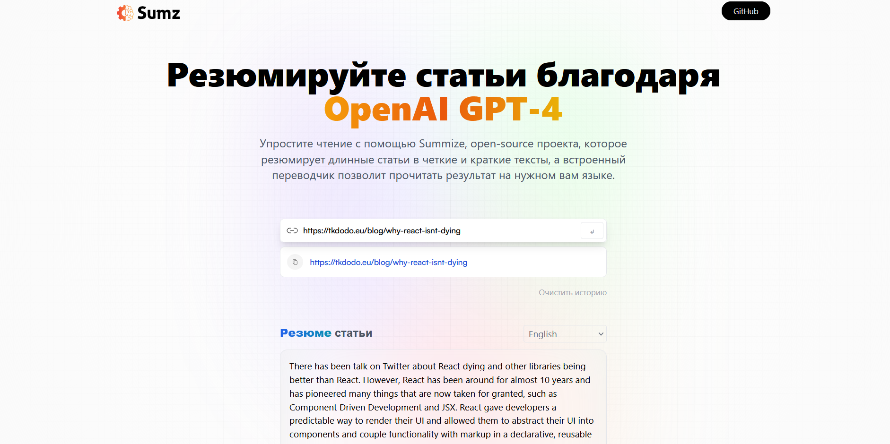

# Summize

## О проекте

Summize - это ИИ-сайт, который резюмирует блоги и статьи для пользователей.

## Функциональность

-   Резюмирование блогов и статей
-   Возможность вставки ссылок на любую публикацию
-   Перевод текста на нужный язык

## Стэк технологий

-   React
-   Redux
-   TypeScript
-   TailwindCSS

## Ссылка: https://summize-five.vercel.app/
